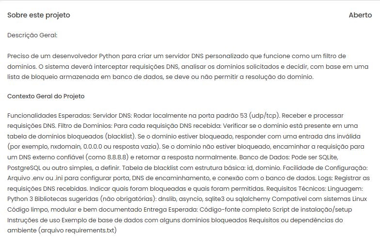

# DNS-Server

This is a simple project with the goal of studying real-life requests and deepening my knowledge about DNS servers and web application development.

The request below was published on Workana and asks for the creation of a DNS server in which the administrator can register the domains he wants to block, making it so that the computers on the network can no longer access the blocked domain.



## Technologies
- Docker
- Python 3.12
- PHP 8.2
- Flight Framework (PHP)
- SQLite3

### Libs
- dnslib
- dns
- dotenv

## Architecture
```
dns-server/
|-- config/
|    |-- __init__.py
|    |-- init.py
|    |-- seed.py
|-- interface/
|-- logs/
|   |-- app.log
|-- scripts/
|   |-- run.sh
|   |-- seed.sh
|   |-- setup.sh
|   |-- tests.sh
|-- src/
|   |-- __init__.py
|   |--handle_requests.py
|-- tests/
|   |-- test_dns_server.py
|-- .gitignore
|-- docker-compose.yaml
|-- main.py
|-- requirements.txt
```

## Run
1. Clone Repository
```bash
git clone https://github.com/AykoSousa/dns-server.git
```

2. Enter on Repository
```bash
cd dns-server
```

3. Create .env file
```bash
SERVER_ADDRES="0.0.0.0"
SERVER_PORT=53
DB_PATH="./db/dns.db"
```

4. Run Containers
```bash
docker compose up -d
```

The server interface is available in: http://localhost:8000
The dns server is available on port pre-defined env. (ex: 53)

## Web Interface
The interface is responsible for managing domains through a simple interface.
It is mounted in the container from the `/interface` directory.

## Scripts
- `scripts/run.sh` – Start server.

- `scripts/setup.sh` – Install and configure dependencies.

- `scripts/tests.sh` – Run tests.

## Tests
Run tests
```bash
PYTHONPATH=. pytest
```